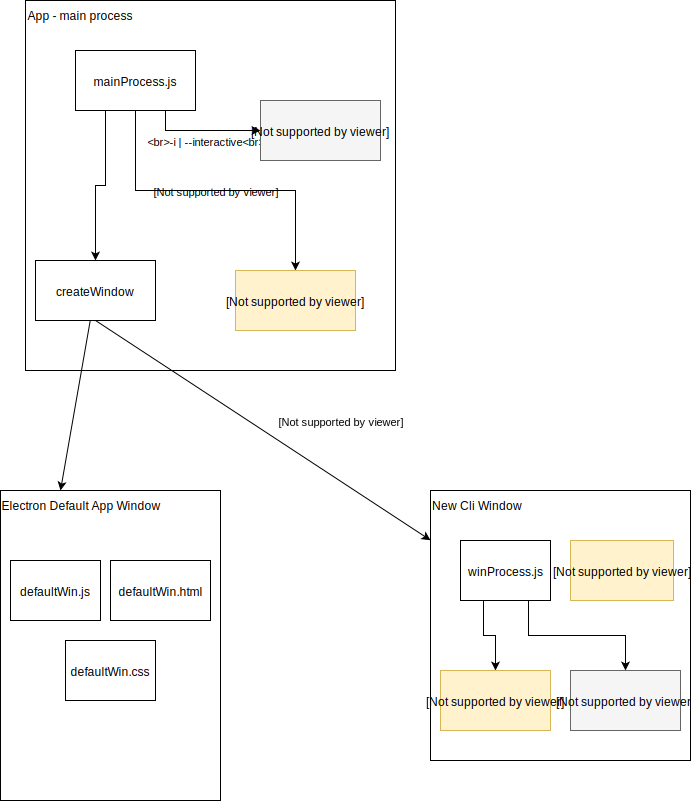

# default_app

This is a default electron application that is compatible with and a superset of the one that ships with electron. It is implements the command line parameters and options that the electron command will accept.

The main feature that this version adds is that it supports running code directly in a BrowserWindow instead of requiring one js module to serve as the main process application and another to be the renderer process in a window that the main process creates.

If an electron main process application is specified, just like the builtin default app, it launches that application and gets out of its way. In this case, none of the new options concerning the BrowserWindow are honoured. 

If wither or both of the new `--win <jsmodule>` or `--url <htmlcontent>` options are specified, a BrowserWindow is created with <jsmodule> launched in its renderer process and <htmlcontent> loaded as the initial page.

There is also a new option `--win-interactive` which, similar to '--interactive|-i|--repl', launches a nodejs REPL application but it launches it in the BrowserWindow instead of the main process. It uses the tty of the terminal where electron is launched so the user continues to use the terminal.

Run `electron -h` to see more details on the command line syntax. 

## Default Application Logic Flow

